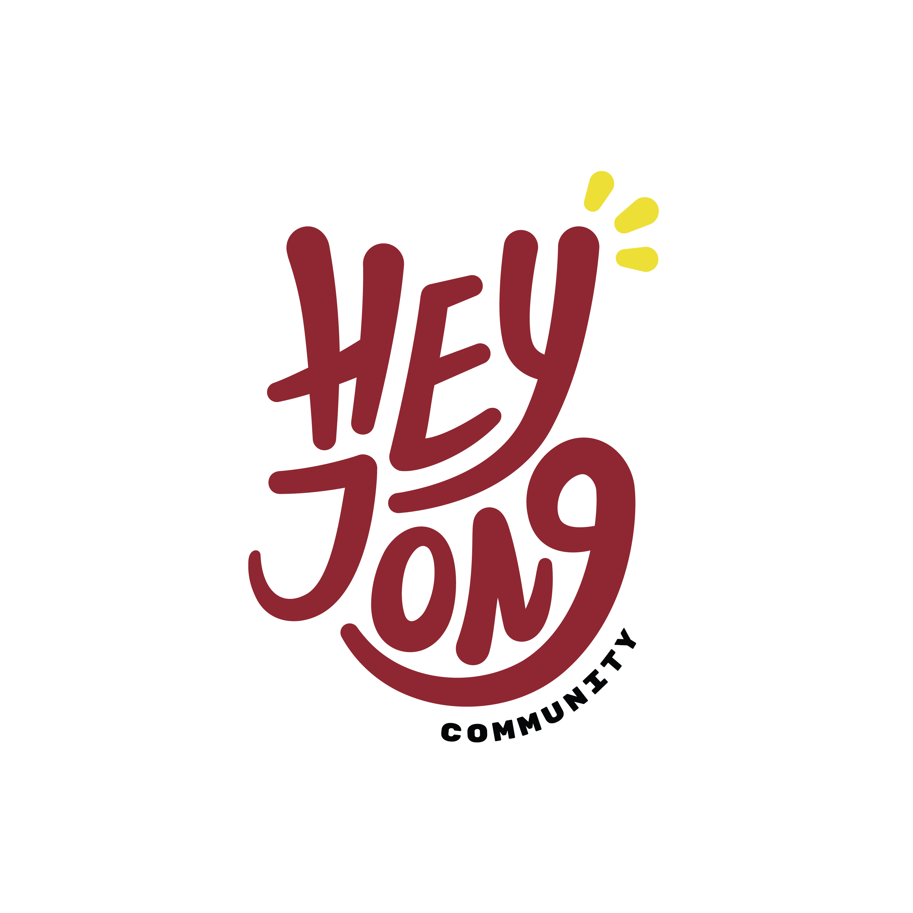

  

<h1 align="center">Heyjong Community</h1>

  <em>Let's Grow Together And Spread Good Vibes.</em>

---

## 📖 Tentang Kami

**Heyjong Community**, sebuah komunitas yang menjadi wadah bagi para pemuda pemudi untuk mengembangkan potensi diri dan melatih daya cipta sehingga mampu berperan aktif dalam menebarkan kebaikan baik di dunia maya dalam bentuk kreasi konten digital maupun dunia nyata dalam bentuk kegiatan-kegiatan sosial.

Project kami seputar:

- 💻 Software development
- 📊 Data & AI

---

## 🛠️ Project

Berikut adalah beberapa project yang sedang kami kembangkan:

- 🔹 [**AI Interview**](https://github.com/org-name/project-1) — Platform interview dengan intergrasi AI untuk kualifikasi lolos tidaknya.

> 💡 Cek semua repositori kami di [tab Repositories](https://github.com/Heyjong-Community/AI-Interview).

---

## 🤝 Kontribusi

Buat Kamu yang mau berkembang bersama, Kami sangat terbuka dengan kontribusi dari siapa pun ✨.  
Jika kamu ingin ikut berkontribusi:

1. Fork repository
2. Buat branch baru (`git checkout -b feature/namamu`)
3. Commit perubahanmu
4. Buat Pull Request 🚀

---

## 👥 Tim Kami

Siapa jongers yang terlibat:

| Nama               | Role                 | GitHub                                           |
| ------------------ | -------------------- | ------------------------------------------------ |
| 👤 Mahdy Mubasyir  | Full-Stack Developer | [@mubasyir19](https://github.com/mubasyir19)     |
| 👤 Zahid Faqih A.R | AI Engineer          | [@zafar2154](https://github.com/zafar2154)       |
| 👤 Ridho Pratama   | AI Engineer          | [@pratamaridho](https://github.com/pratamaridho) |

---

## 📫 Kontak

- 🌐 Website: [https://community.heyjong.id/](https://community.heyjong.id/)
- 💬 How to join: [Join Us](https://heyjong.id/oprecMember)

---

  Powered by <a href="https://github.com/Heyjong-Community">Heyjong Community</a>

